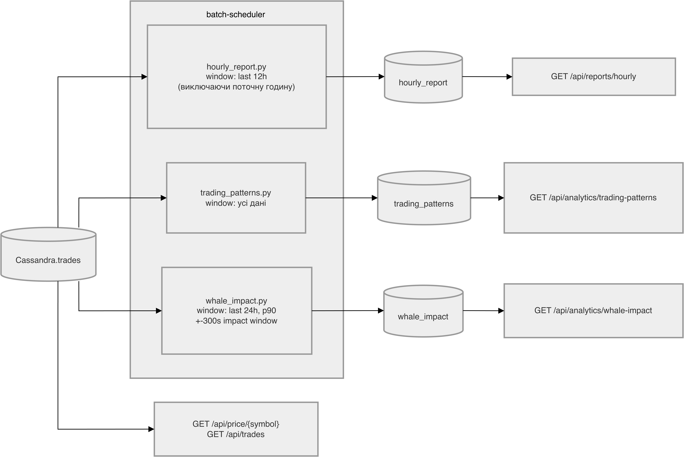
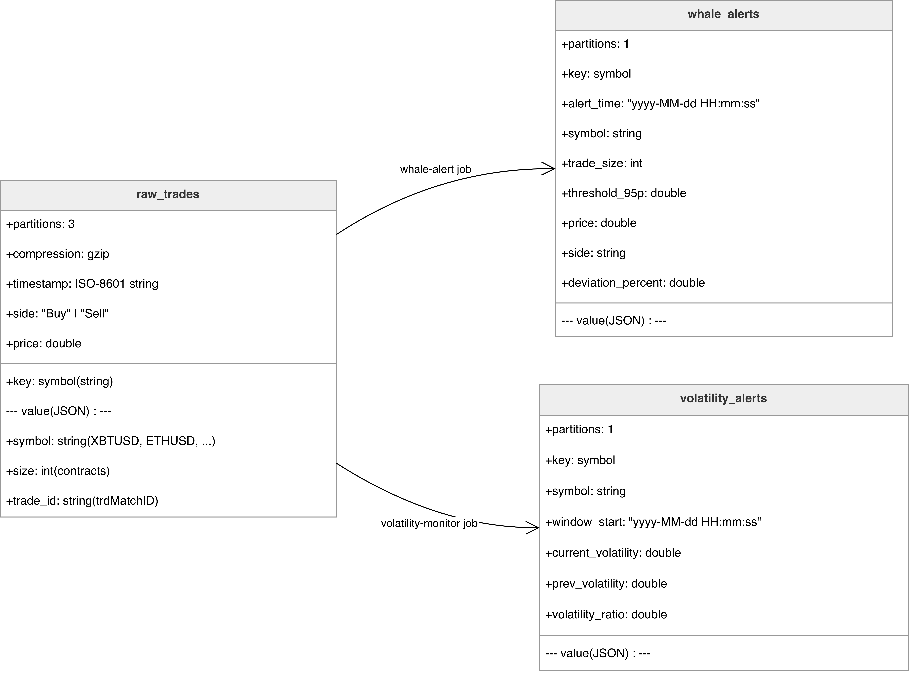

# Design Document: Crypto Market Analytics Platform

## Функціональні вимоги

### Стрімінг

- Виявлення "китів" -- алерт, якщо угода перевищує 95-й перцентиль обсягу за останні 10 хв -> Kafka whale-alerts
- Моніторинг волатильності -- алерт, якщо std ціни за 5 хв зросло вдвічі порівняно з попереднім вікном -> Kafka volatility-alerts
- Дашборд моментуму -- щохвилини: поточна ціна, зміна ціни (%), обсяг, Buy/Sell ratio -> Cassandra market_momentum

### Batch

- Годинний звіт -- кількість угод, обсяг у USD, min/max/avg ціна, волатильність, домінуючий напрямок за останні 12 год
- Аналіз патернів -- години з найвищою активністю та волатильністю, середній bid-ask spread по годинах
- Аналіз "китів" -- угоди вище 90-го перцентиля, зміна ціни протягом 5 хв після кожної такої угоди, середній price impact

### Ad-hoc API

- GET /api/price/{symbol} — OHLCV за інтервалом (1m / 5m / 1h)
- GET /api/trades -- фільтрація угод за символом, розміром, напрямком

## Архітектура системи

### High-level Data Flow 

### Data flow на прикладі

### Компоненти

- **Ingestion service (`ingestion/main.py`)**
  - Підключається до BitMEX WebSocket (`trade:{symbol}`).
  - Нормалізує трейд-події.
  - Пише в Kafka topic `raw-trades`.

- **Kafka**
  - Буферизація та decoupling producer/consumer.
  - Topics:
    - `raw-trades`
    - `whale-alerts`
    - `volatility-alerts`

- **Streaming jobs (Spark Structured Streaming)**

  - `trades_sink.py`: `raw-trades` -> Cassandra `trades`.
  - `whale_alert.py`: `raw-trades` -> `whale-alerts`.
  - `volatility_monitor.py`: `raw-trades` -> `volatility-alerts`.
  - `market_momentum.py`: `raw-trades` -> Cassandra `market_momentum`.

- **Batch jobs (Spark)**

  - `hourly_report.py` -> Cassandra `hourly_report`.
  - `trading_patterns.py` -> Cassandra `trading_patterns`.
  - `whale_impact.py` -> Cassandra `whale_impact`.
  - `scheduler.py` запускає jobs за cron.

- **Cassandra**
  - Операційне сховище для стрімінгу і batch результатів.

- **FastAPI (`api/`)**
  - Meta endpoints (`/health`, `/ready`).
  - API для B,C аналітики.

- **UI/моніторинг**
  - Kafka UI, Spark UI.

## Обґрунтування вибору технологій

- **Kafka**: надійна буферизація і масштабування ingest/consume незалежно.
- **Spark Structured Streaming**: один стек для streaming і batch, вбудовані window/watermark/aggregation.
- **Cassandra**: добре підходить для time-series і читання за partition key (`symbol`) з низькою затримкою.
- **FastAPI**: швидкий development API з OpenAPI/Swagger out of the box.

## Data model

Cassandra DDL -- `dependencies/cassandra/init.cql`. Keyspace `crypto`, `SimpleStrategy` RF=1.

### Kafka topics -- структура повідомлень

#### `raw-trades` (producer: `ingestion/main.py`)
JSON, key = `symbol`, value:

| Field       | Type   | Notes                                |
|-------------|--------|--------------------------------------|
| `timestamp` | string | ISO8601 from BitMEX (`trade.timestamp`) |
| `symbol`    | string | напр. `XBTUSD`                       |
| `side`      | string | `Buy` / `Sell`                       |
| `size`      | int    | contracts                            |
| `price`     | double | trade price                          |
| `trade_id`  | string | BitMEX `trdMatchID`                  |

Incomplete records (`timestamp`/`symbol`/`size`/`price` is null) дропаються в ingestion.

#### `whale-alerts` (producer: `streaming/whale_alert.py`)

| Field               | Type   | Notes                                            |
|---------------------|--------|--------------------------------------------------|
| `alert_time`        | string | `yyyy-MM-dd HH:mm:ss`, час whale-трейду          |
| `symbol`            | string |                                                  |
| `trade_size`        | int    | розмір аномальної угоди                          |
| `threshold_95p`     | double | p95 size у 10-хв вікні                           |
| `price`             | double |                                                  |
| `side`              | string |                                                  |
| `deviation_percent` | double | `(trade_size - threshold_95p) / threshold_95p * 100` |

#### `volatility-alerts` (producer: `streaming/volatility_monitor.py`)

| Field                | Type   | Notes                                  |
|----------------------|--------|----------------------------------------|
| `symbol`             | string |                                        |
| `window_start`       | string | `yyyy-MM-dd HH:mm:ss`, поточне 5-хв вікно |
| `current_volatility` | double | stddev(price) поточного вікна          |
| `prev_volatility`    | double | stddev(price) попереднього вікна       |
| `volatility_ratio`   | double | `current / prev`, округлено до 2       |

### Cassandra `trades`

Призначення: сирі/очищені трейди, джерело для всіх downstream задач.

| Column       | Type      | Role           |
|--------------|-----------|----------------|
| `symbol`     | text      | partition key  |
| `trade_time` | timestamp | clustering (DESC) |
| `trade_id`   | text      | clustering     |
| `price`      | double    |                |
| `size`       | int       |                |
| `side`       | text      | `Buy` / `Sell` |

PK: `((symbol), trade_time, trade_id)`. TTL = 604800s (7 днів).
Access pattern: range scan `WHERE symbol = ? AND trade_time >= ? AND trade_time < ?`.

### Cassandra `market_momentum`
1-хв streaming метрики (A3).

| Column             | Type      | Role          |
|--------------------|-----------|---------------|
| `symbol`           | text      | partition key |
| `window_start`     | timestamp | clustering (DESC) |
| `last_price`       | double    | close price вікна |
| `price_change_pct` | double    | `(last - first) / first * 100` |
| `volume_usd`       | double    | sum(size*price) |
| `buy_ratio`        | double    | buy_volume / total_volume |

PK: `(symbol, window_start)`.

### Cassandra `hourly_report`
Погодинні агрегати (B1).

| Column          | Type      | Role          |
|-----------------|-----------|---------------|
| `symbol`        | text      | partition key |
| `hour_bucket`   | timestamp | clustering (DESC), truncated до години |
| `trade_count`   | int       |               |
| `total_volume`  | double    | sum(size)     |
| `min_price`     | double    |               |
| `max_price`     | double    |               |
| `avg_price`     | double    |               |
| `volatility`    | double    | stddev(price) |
| `dominant_side` | text      | `Buy` / `Sell` по обсягу |

PK: `((symbol), hour_bucket)`.

### Cassandra `trading_patterns`
Середні метрики по годинах доби (B2).

| Column           | Type   | Role          |
|------------------|--------|---------------|
| `symbol`         | text   | partition key |
| `hour_of_day`    | int    | clustering, 0–23 |
| `avg_trades`     | double | середня кількість трейдів за годину доби |
| `avg_volume`     | double | середній обсяг |
| `avg_spread`     | double | `max_price - min_price` усереднений |
| `avg_volatility` | double | середній stddev по hour_bucket |

PK: `(symbol, hour_of_day)`. Upsert-перезапис на кожен прогін.

### Cassandra `whale_impact`
Whale-трейди + оцінка post-trade impact (B3).

| Column             | Type      | Role          |
|--------------------|-----------|---------------|
| `symbol`           | text      | partition key |
| `trade_time`       | timestamp | clustering (DESC) |
| `trade_id`         | text      | clustering    |
| `trade_size`       | int       |               |
| `trade_price`      | double    |               |
| `side`             | text      |               |
| `avg_price_before` | double    | mean(price) у вікні `-300s` |
| `avg_price_after`  | double    | mean(price) у вікні `+300s` |
| `price_impact_pct` | double    | `(after - before) / before * 100` |

PK: `((symbol), trade_time, trade_id)`.

### Обґрунтування партиціювання
- `symbol` як partition key -- всі read patterns (streaming sink, batch jobs, API) фільтрують по символу.
- `trade_time DESC` clustering -- newest-first читання без `ORDER BY` в API.
- `trade_id` у clustering ключі `trades` / `whale_impact` -- уникає колізій при однаковому `trade_time`.
- `hour_of_day` для `trading_patterns` -- фіксований кардиналітет 24, безпечне partition size.

## Streaming design details

### A1 Whale Alert

Логіка:
1. Watermark: 10 хв.
2. Window: 10 хв, slide 1 хв, групування по `symbol`.
3. `percentile_approx(size, 0.95)` -> `threshold_95p`.
4. Трейди з `trade_size > threshold_95p` -> alert.
5. `deviation_percent = ((trade_size - threshold_95p) / threshold_95p) * 100`.

Output: Kafka `whale-alerts`.

### A2 Volatility Monitor

Логіка:
1. Вікна по 5 хв для кожного `symbol`.
2. Рахуємо `stddev(price)` для current і previous window.
3. Alert, якщо `current_volatility > 2 * previous_volatility`.

Output: Kafka `volatility-alerts`.

### A3 Market Momentum

Логіка:
1. 1-хвилинні вікна.
2. Метрики: `last_price`, `price_change_pct`, `volume_usd`, `buy_ratio`.
3. foreachBatch write -> Cassandra `market_momentum`.

Latency target: < 1 хв для оновлення метрик.

## Batch design details

### Оркестрація

`batch/scheduler.py` запускає jobs через APScheduler:
- `hourly_report`: `5 * * * *`
- `trading_patterns`: `*/30 * * * *`
- `whale_impact`: `15 * * * *`

Додатково `RUN_ON_STARTUP=true` тригерить стартові прогони після підняття.

### B1 Hourly Report

Джерело: `trades` за останні `HOURS_BACK` (default 12), без поточної неповної години.
Розрахунки:
- count, total volume, min/max/avg price, stddev, dominant side.

### B2 Trading Patterns

Джерело: вся накопичена історія `trades`.
Кроки:
1. агрегат по `(symbol, hour_of_day, hour_bucket)`;
2. середні метрики по `hour_of_day`.

### B3 Whale Impact

Джерело: `trades` за `WHALE_IMPACT_HOURS` (default 24).
Кроки:
1. обчислити p90 size threshold per symbol;
2. знайти whale trades;
3. window +/-300 сек для `avg_price_before` / `avg_price_after`;
4. `price_impact_pct` як відносна зміна.

## API design

### Meta
- `GET /health` -> `{"status":"ok"}`
- `GET /ready` -> перевірка Cassandra підключення

### B APIs
- `GET /api/reports/hourly?symbol=XBTUSD&hours=12`
- `GET /api/analytics/trading-patterns?symbol=XBTUSD&top_n=3`
- `GET /api/analytics/whale-impact?symbol=XBTUSD&period=24h&top_n=20`

### C APIs
- `GET /api/price/{symbol}?from=...&to=...&interval=1m|5m|1h`
- `GET /api/trades?symbol=XBTUSD&min_size=10000&side=Buy&limit=100`

## Нефункціональні аспекти

- Надійність
  - Docker restart policy `unless-stopped`.
  - Reconnect/retry в ingestion та Cassandra API client.
- Продуктивність
  - Spark worker ресурси обмежені, конфігуровані через compose env.
  - Kafka compression `gzip` в ingestion producer.
- Спостережуваність
  - Логи кожного сервісу (`docker logs ...`).
  - Kafka UI / Spark UI.
- Відтворюваність
  - Все піднімається через один `docker compose up -d --build`.

## Труднощі, ризики

- BitMEX WebSocket доступність впливає на ingestion, повідомлення не отримуються через зʼєднання із BitMEX або ж через rate limiting.
- Локальні ресурси (RAM/CPU) можуть стати ботлнеком, труднощами було якраз розподілити ресурси між усіма компонентами так, аби нічого не "підпадало". Раніше згадане обмеження ресурсів для Spark worker також через те, що він "виїдав" усі ресурси
