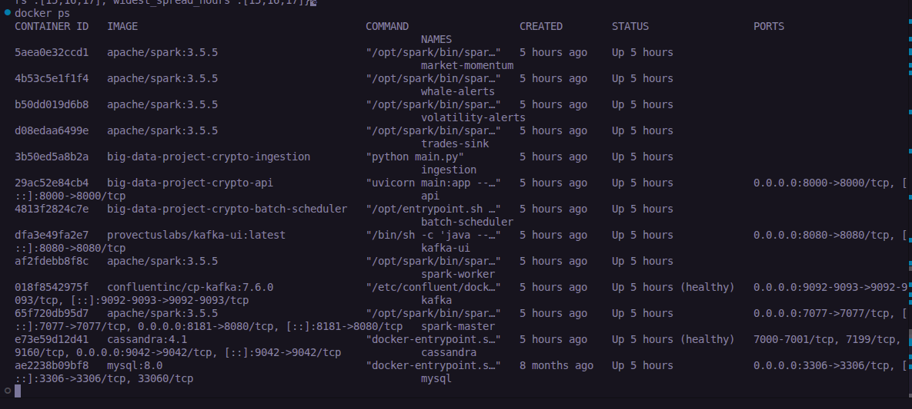
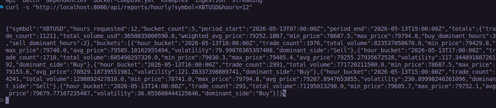
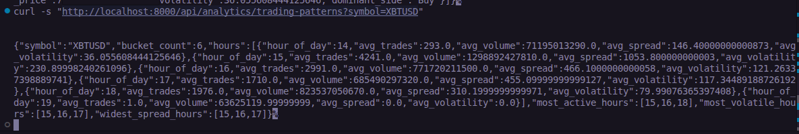
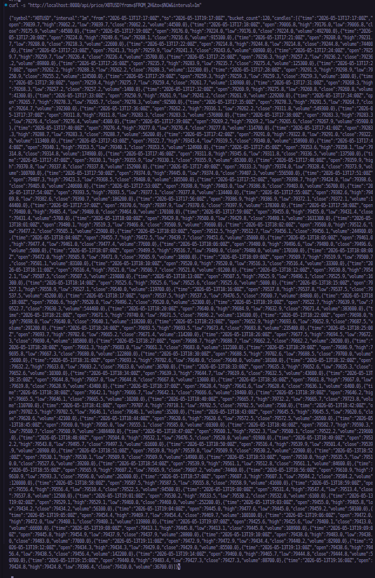
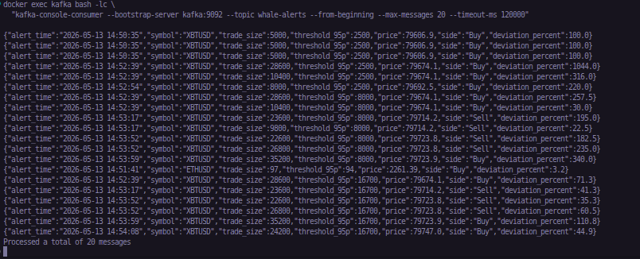
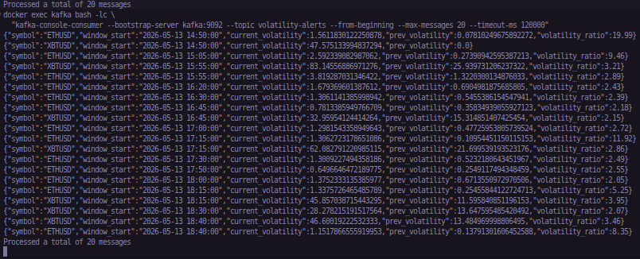

# Crypto analytics platform

[Design document](DESIGN_DOCUMENT.md) is provided in the repo. Deliverables are in a respective [folder](./examples).

## Stack

- **Ingestion**: Python (`websockets`, `kafka-python`)
- **Message bus**: Apache Kafka
- **Streaming/Batch compute**: Apache Spark 3.5 (Structured Streaming + batch jobs)
- **Storage**: Apache Cassandra 4.1
- **API**: FastAPI + Uvicorn
- **Observability/UI**: Kafka UI, Spark Master UI
- **Orchestration**: Docker Compose

## Dependencies

- Docker Desktop
- Minimum 8 GB RAM for stability
- Free ports: `8000`, `8080`, `8181`, `9092`, `9042`
- Bash / zsh, `curl`, `python3`

## Config

Create `.env` file and paste:

```env
KAFKA_BROKER=kafka:9092
CASSANDRA_HOST=cassandra
CASSANDRA_PORT=9042
CASSANDRA_KEYSPACE=crypto
BITMEX_WS_URL=wss://ws.bitmex.com/realtime
SYMBOLS=XBTUSD,ETHUSD
```

## Quick start

### Start the system

```bash
docker compose up -d --build
```

Check status:

```bash
docker compose ps
```



### Convenient UIs:

- Kafka UI: [http://localhost:8080](http://localhost:8080)
- Spark Master UI: [http://localhost:8181](http://localhost:8181)
- API docs (Swagger): [http://localhost:8000/docs](http://localhost:8000/docs)

### Health/readiness

```bash
curl -s http://localhost:8000/health
curl -s http://localhost:8000/ready
```

## API results

### B1 hourly report

```bash
curl -s "http://localhost:8000/api/reports/hourly?symbol=XBTUSD&hours=12"
```



### B2 trading patterns

```bash
curl -s "http://localhost:8000/api/analytics/trading-patterns?symbol=XBTUSD&top_n=3"
```



### B3 whale impact


```bash
curl -s "http://localhost:8000/api/analytics/whale-impact?symbol=XBTUSD&period=24h&top_n=20"
```



### C1 price history


```bash
curl -s "http://localhost:8000/api/price/XBTUSD?from=2026-05-13T10:00:00Z&to=2026-05-13T12:00:00Z&interval=1m"
```

### C2 trade lookup

```bash
curl -s "http://localhost:8000/api/trades?symbol=XBTUSD&min_size=10000&side=Buy&limit=100"
```

## Streaming results

### A1 whale alerts

```bash
docker exec kafka kafka-console-consumer \
  --bootstrap-server kafka:9092 \
  --topic whale-alerts \
  --from-beginning \
  --max-messages 10
```


### A2 volatility alerts
```bash
docker exec kafka kafka-console-consumer \
  --bootstrap-server kafka:9092 \
  --topic volatility-alerts \
  --from-beginning \
  --max-messages 10
```



## Stop and clear

```bash
docker compose down
```

Full clean up of volumes (removes data):

```bash
docker compose down -v
```

